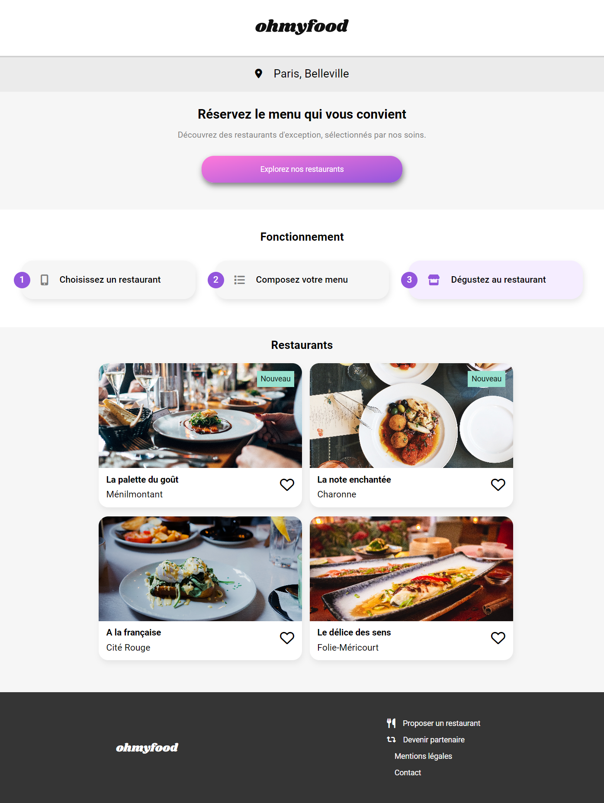
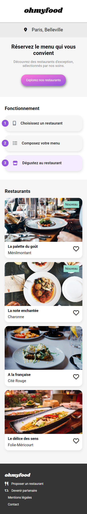

# __MyDevWebLearning-P3-project: Ohmyfood__

Troisième projet du parcours "Développeur web" chez OpenClassroom. L'objectif de ce projet est d'intégrer puis de dynamiser une page web avec des animations CSS en utilisant le préprocesseur Sass.

Vous trouverez [le brief complet  du projet](https://s3-eu-west-1.amazonaws.com/course.oc-static.com/projects/DW_P3/Brief%20cre%CC%81atif%20-%20Ohmyfood!.pdf) ici.

 ## <ins>Aperçu du projet</ins>  &nbsp;  

  &nbsp;

  

## <ins> Objectifs </ins>

1. Développer un site proposant le menu de 4 grands restaurants parisiens.
2. Permettre la réservation en ligne et la composition de menus.

## <ins> Livrables </ins>

### Pages à intégrer selon les maquettes

+ Page d’accueil
+ Pages de menu (x4)
